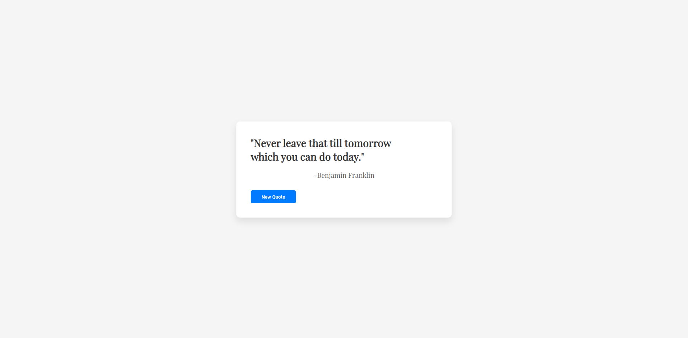

# Random-Quote-Generator
A simple JavaScript app that generates random quotes every time you click the "New Quote" button.

## Features
- Displays random quotes along with the author's name.
- Responsive design, looks great on mobile and desktop.
- Built with pure HTML, CSS, and vanilla JavaScript.

## How to Use
1. Clone the repository.
2. Open the `index.html` file in your browser.

## Technologies Used
- HTML5
- CSS3
- JavaScript (ES6)

## License
This project is licensed under the MIT License - see the [LICENSE](LICENSE) file for details.

## Screenshots:

